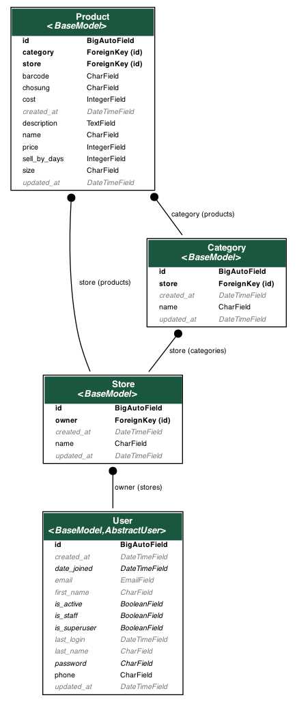
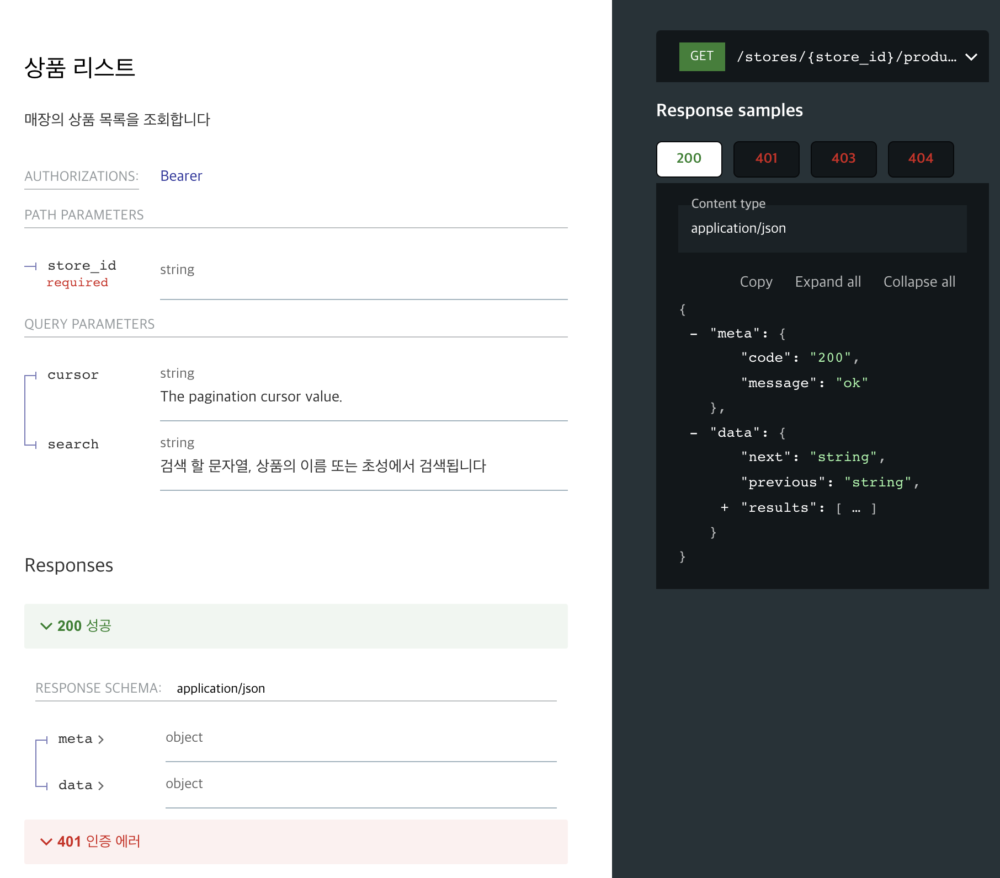

페이히어 과제전형, 카페 포스 시스템에 필요한 RestAPI 만들기

- 진행 기간: 2023.4.19 ~ 2023.4.24

</br>

[TOC]

</br>

# 1.실행 방법

*과제인 점을 감안하여 설정 파일을 같이 푸시하였습니다*

</br>

## 1.1.프로덕션(docker-compose)

```bash
git clone https://github.com/gghotted/payhere-assignment2
cd payhere-assignment2
docker-compose --env-file .env build
docker-compose --env-file .env up
```

**http://localhost/redoc/ 에서 API 문서를 볼 수 있습니다**

**http://localhost/swagger/ 에서 API를 테스트할 수 있습니다**

</br>

## 1.2.로컬

```bash
git clone https://github.com/gghotted/payhere-assignment2
cd payhere-assignment2

virtualenv venv
source venv/bin/activate
pip install -r requirements.txt

cd apps
python manage.py migrate
python manage.py runserver

# 테스트 실행
python manage.py test
```

</br>

# 2.구현

</br>

## 2.1.모델



- `BaseModel`: 모든 model이 상속 받는 Model입니다. `create_at`, `update_at` field를 가집니다
- `User`: `auth.AbstractUser`를 상속받고 `phone` field를 추가 했습니다
- `Store`: `User`가 여러 개의 `Store`를 등록할 수 있습니다
- `Category`: `Store`에 여러 개의 `Category`를 등록할 수 있습니다
- `Product`: `Store`에 여러 개의 `Product`를 등록할 수 있습니다. 또한  `Category`에 여러 개의 `Product`를 등록할 수 있습니다. 초성 검색을 위해 `name`과 별개로 `chosung` field가 있습니다

</br>

## 2.2.API

</br>

### 2.2.1.엔드포인트

| 기능                      | Endpoint                                     | 메소드             |
| ------------------------- | -------------------------------------------- | ------------------ |
| 토큰 생성                 | /auth/tokens/                                | POST               |
| 토큰 리프레시             | /auth/tokens/refresh/                        | POST               |
| 리프레시 토큰 폐기        | /auth/tokens/blacklist/                      | POST               |
| 유저 생성                 | /users/                                      | POST               |
| 매장 목록, 생성           | /users/self/stores/                          | GET, POST          |
| 매장 상세, 수정, 삭제     | /stores/{store_id}/                          | GET, PATCH, DELETE |
| 카테고리 목록, 생성       | /stores/{store_id}/categories/               | GET, POST          |
| 카테고리 상세, 수정, 삭제 | /stores/{store_id}/categories/{category_id}/ | GET, PATCH, DELETE |
| 상품 목록, 생성           | /stores/{store_id}/products/                 | GET, POST          |
| 상품 상세, 수정, 삭제     | /stores/{store_id}/products/{product_id}/    | GET, PATCH, DELETE |

상세 스팩은 **http://localhost/redoc/** , **http://localhost/swagger/** 에서 볼 수 있습니다

10개의 엔드포인트, 19개의 API로 요구사항을 구현 하였습니다. **restful**을 목표로 엔드포인트와 메소드를 사용했습니다. 엔드포인트는 쉽게 이해할 수 있게 상위 리소스를 포함하였고 너무 길어질 경우 오히려 가독성이 떨어지므로 적절하게 분할 하였습니다.

</br>

### 2.2.2.View

모든 `View`는 `cbv`로 구현 하였습니다. 요구 사항이 일반적인 CRUD 이므로  `rest_framework`의 `GenericAPIView` 클래스를 적극 활용하고 필요한 부분만 override 하였습니다.

요구사항의 API response 포맷을 구현하기 위해 `APIView.finalize_response`를 override하는 [`WrappedResponseDataMixin`](https://github.com/gghotted/payhere-assignment2/blob/756022d767c6b3619b6b1086664d8a588cd142d1/apps/core/views.py#L5)를 만들었습니다. 모든 `View`가 이 Mixin을 상속하여 response data를 랩핑 하였습니다.

</br>

### 2.2.3.인증

`simplejwt`라는 패키지를 통해 jwt 인증 기능을 연동했습니다. `access token`은 1시간, `refresh token`은 7일로 유효기간을 설정하여 하였습니다. 또한 `refresh token`을 강제로 무효화할 수 있는 `blacklist` 기능을 제공 하여 보안을 강화했습니다.

마찬가지로 `simplejwt`가 제공하는 `View`를 `WrappedResponseDataMixin`와 다중 상속하여 API를 제공 하였습니다. 

</br>

## 2.3.테스트

**89**개의 테스트 케이스를 만들어 기능의 신뢰도를 높였습니다. 다양한 상황의 request를 테스트 했고 특히 중요한 **인증, 권한**에 대한 테스트 케이스는 모든 API에 만들었습니다.

또한 schema validation 기능을 제공하는 `schema`라는 패키지를 이용하여, 모든 API 응답구조가 정의한 schema와 일치하는지 체크 하였습니다.

그리고 `setUpTestData`와 `setUp` method를 적절하게 구분하여 사용하여 테스트가 효율적으로 진행되게 하였습니다.

</br>

### 2.3.1.쿼리

모든 API마다 최소 한번은 쿼리 수를 테스트 하였습니다. 내부적으로 어느 시점에 어떤 쿼리를 DB에 요청하는지 예상해보고 체크 했습니다. 한 번에 요청 가능한 데이터들은 `select_related`를 활용하여 쿼리 낭비를 줄였습니다.

</br>

## 2.4.drf-yasg를 활용한 문서화

**Redoc**



</br>

**Swagger**


</br>

### 2.4.1.사용 이유

지금 까지의 경험으로는 기능, 테스트 코드를 짜는 것 만큼이나 API 문서화에 들이는 노력이 많이 필요했던 것 같았습니다. 별도로 문서 작업을 해야하고 기능이 수정될 때마다 동기화 하는 작업이 은근히 번거로운 작업 이었습니다.

drf를 사용하면서 `notion`, `swagger-hub`, `postman`과 비교했을 때 `drf-yasg`의 가장 큰 장점은 `serializer` 기반으로 문서를 작성할 수 있다는 점이라고 생각합니다. 이미 만들어진 `serializer`를 재사용하여 request, response를 빠르게 정의할 수 있었습니다. 또한 기능 구현에 사용된 `serializer`를 재사용 하기 때문에 문서와 실제 구현이 다를 위험이 적었습니다.

그리고 `View`에 문서를 정의하기 때문에 `View`가 어떤 작업을 하는지 쉽게 파악할 수 있는 장점도 있습니다. 개인적으로는 `cbv`내부에 문서를 정의하면 코드 보기가 복잡하다고 느껴져서 클래스 외부에서 연결하여 사용했습니다.

</br>

### 2.4.2.Response 커스텀

`serializer`는 모델의 구조만 가지고 있기 때문에, 요구 사항의 응답 샘플 처럼 response를 구성하기 위해서는 추가 작업이 필요했습니다. 제공하는 기능을 찾아보려고 했지만, `serializer`를 `drf_yasg.openapi.Scheam`형태로 변환하는 기능은 찾을 수 없었습니다.

검색으로는 찾을 수 없었지만, 분명 `drf_yasg`내부적으로 사용되는 기능이기에 패키지 내부를 디버깅 하며 찾아 보았습니다. 그래서 `InlineSerializerInspector`라는 class로 schema로 변환하는 것을 찾았고, `serializer`를 최종적인 response schema로 변환하는 [코드](https://github.com/gghotted/payhere-assignment2/blob/756022d767c6b3619b6b1086664d8a588cd142d1/apps/core/yasg/schemas.py#LL1)를 작성할 수 있었습니다.

</br>

## 2.5.주요 사용 패키지

- [Django](https://github.com/django/django)
- [djangorestframework](https://github.com/encode/django-rest-framework)
- [djangorestframework-simplejwt](https://github.com/jazzband/djangorestframework-simplejwt)
- [drf-yasg](https://github.com/axnsan12/drf-yasg)
- [freezegun](https://github.com/spulec/freezegun)
- [jamo](https://github.com/JDongian/python-jamo)
- [schema](https://github.com/keleshev/schema)
- [black](https://github.com/psf/black)
